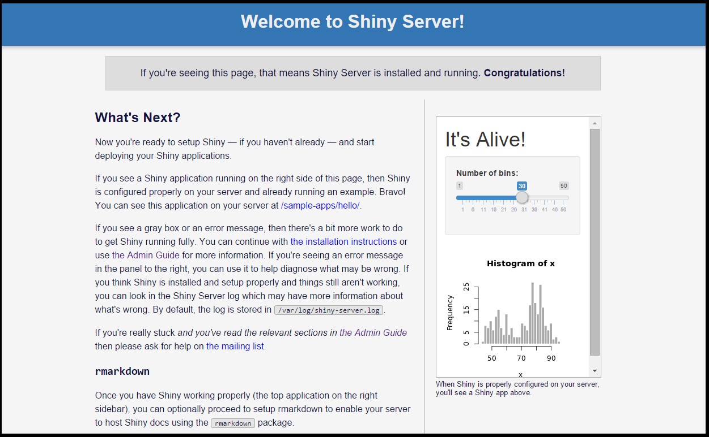

# Robolog Analytics

This document covers the installation of R and Shiny Server on an Ubuntu Desktop 14.04 LTS (64-bit) server instance running the Robolog configuration.  It assumes that you have followed the Robolog Server setup and tested the CKAN Data Portal. The instructions were tested with R version 3.2.3 and Shiny Server 1.4.1.

Two sample applications are provided, a dashboard that allows you to visualize common metrics over time, and a query interface to CKAN showing the results of tag queries in JSON. The latter can be useful for debugging and programming.
## Install R and commonly used R packages

The Libcur4-gnutls-dev package is required for curl and curl-config support:

	sudo apt-get install libcurl4-gnutls-dev

## Install the R language:
	
	sudo sh -c 'echo "deb http://cran.rstudio.com/bin/linux/ubuntu trusty/" >> /etc/apt/sources.list'
	sudo gpg --keyserver keyserver.ubuntu.com --recv-key E084DAB9
	sudo gpg -a --export E084DAB9 | sudo apt-key add -
	sudo apt-get update
	sudo apt-get install r-base
	
## Install the R packages used by Shiny and the sample applications:

	sudo su - -c "R -e \"install.packages('rmarkdown', repos='http://cran.rstudio.com/')\""
	sudo su - -c "R -e \"install.packages('ggplot2', repos='http://cran.rstudio.com/')\""
	sudo su - -c "R -e \"install.packages('shiny', repos='http://cran.rstudio.com/')\""
	sudo su - -c "R -e \"install.packages('plotly', repos='http://cran.rstudio.com/')\""
	sudo su - -c "R -e \"install.packages('ckanr', repos='http://cran.rstudio.com/')\""	
	sudo su - -c "R -e \"install.packages('RCurl', repos='http://cran.rstudio.com/')\""
	
## Install Shiny Server:

	sudo apt-get install gdebi-core
	cd $HOME/Downloads
	wget https://download3.rstudio.org/ubuntu-12.04/x86_64/shiny-server-1.4.1.759-amd64.deb
	sudo gdebi shiny-server-1.4.1.759-amd64.deb

	sudo service shiny-server restart

## Clone the Robolog GitHub repository (if needed)

	cd $HOME
	git clone https://github.com/Juxtapose-Technologies/Robolog.git
	
## Deploy the sample applications

	cd $HOME/Robolog/analytics
	sudo cp -r ./shiny-dashboard-prototype/ /srv/shiny-server/
	sudo cp -r ./shiny-query-prototype/ /srv/shiny-server/

## Test the applications

Use your browser to navigate to the following URLs:

[http://localhost:3838/shiny-query-prototype/](http://localhost:3838/shiny-query-prototype/)

You should see:

[http://localhost:3838/shiny-dashboard-prototype/](http://localhost:3838/shiny-dashboard-prototype/)

You should see:

To view general information about Shiny and additional samples, go to:

[http://localhost:3838](http://localhost:3838)

You should see:

