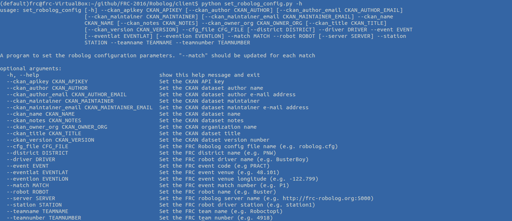
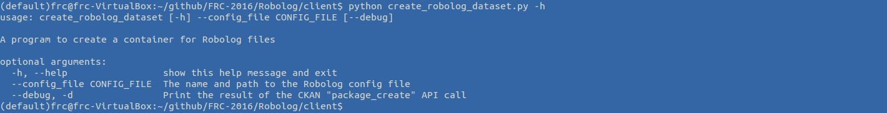
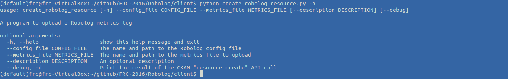

# Robolog Client

There are three tasks that need to be performed on a regular basis.

### Setup the robolog.cfg file:

This file contains the majority of the parameters needed to create datasets and resources in CKAN.  You will typically generate a new configuration file once per practice day or competition event.

To review *robolog.cfg*:

    cat robolog.cfg

To change settings, edit *set_robolog_config.sh*:

    vi set_robolog_config.sh

To generate a new *robolog.cfg*:

    ./set_robolog_config.sh

To view help:

    python set_robolog_config.py -h

(See [argparse](https://docs.python.org/2/library/argparse.html) documentation for help with interpretation of mandatory vs. optional parameters)

### Create a CKAN dataset to hold all of the metric files for a practice day or competition event:

The *create_robolog_dataset.sh* script calls a Python program that reads *robolog.cfg*:

    ./create_robolog_dataset.sh

After running this script the new dataset should be visible at [http://localhost:5000](http://localhost:5000)

To view help:

    python create_robolog_dataset.py -h

### Create a CKAN resource (i.e. file) for each metric file that the robot produces:

The *create_robolog_resource.sh* script gives an example of how to use the command line to specify the filename.  

    ./create_robolog_resource.sh

After running this script the new resource should be visible at [http://localhost:5000](http://localhost:5000)

To view help

    python create_robolog_resource.py -h

