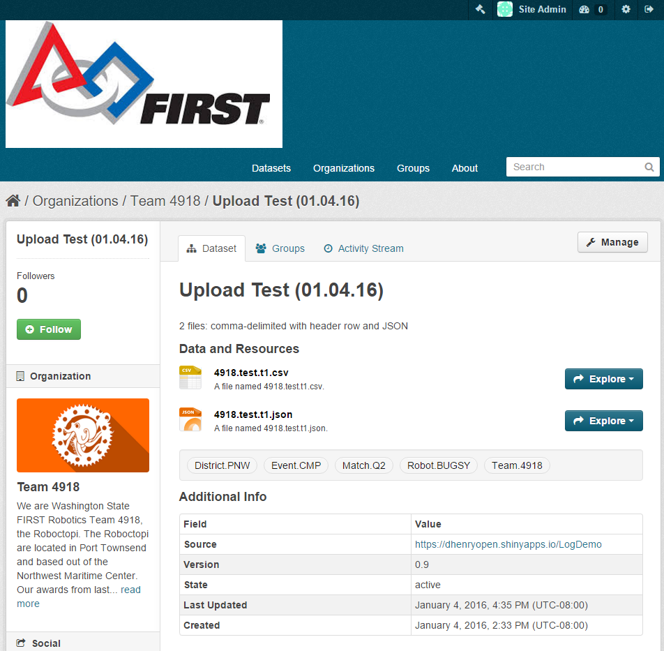

# Robolog Client

These shell scripts & python programs allow an FRC team to load robot metrics data into a CKAN data portal. The metrics are generated by a Team 4918's custom [LabVIEW FRC 2016] (https://wpilib.screenstepslive.com/s/4485/m/13811) VI module that records various runtime parameters [work in progress](https://github.com/Juxtapose-Technologies/Robolog/tree/master/LabVIEW%20Code).

## Getting Started

These instructions are intended to support pre-season bench testing of the CKAN data portal at [http://frc-robolog.org:5000](http://frc-robolog.org:5000)

### Prerequisities

The python programs where developed on Ubuntu 14.04.1 using Python 2.7.6.  The following Python modules must be available:

* argparse
* csv
* ConfigParser
* json
* pprint
* requests
* sys
* urllib
* urllib2

The shell scripts use the bash shell.

### Installation

Use _git_ to clone the repository: 

    git clone https://github.com/dhenryopen/FRC-2016.git

## Usage

There are three tasks that need to be performed on a regular basis.

### Setup the robolog.cfg file:

This file contains the majority of the parameters needed to create datasets and resources in CKAN.  You will typically generate a new configuration file once per practice day or competition event.

To review *robolog.cfg*:

    cat robolog.cfg

To change settings, edit *set_robolog_config.sh*:

    vi set_robolog_config.sh

To generate a new *robolog.cfg*:

    ./set_robolog_config.sh

### Create a CKAN dataset to hold all of the metric files for a practice day or competition event:

The *create_robolog_dataset.sh* script calls a Python program that reads *robolog.cfg*:

    ./create_robolog_dataset.sh

After running this script the new dataset should be visible at [http://frc-robolog.org:5000](http://frc-robolog.org:5000)

### Create a CKAN resource (i.e. file) for each metric file that the robot produces:

The *create_robolog_resource.sh* script gives an example of how to use the command line to specify the filename.  

    ./create_robolog_resource.sh

After running this script the new resource should be visible at [http://frc-robolog.org:5000](http://frc-robolog.org:5000)

### Summary of config options (output of *python set_robolog_config.py -h*):

(See [argparse](https://docs.python.org/2/library/argparse.html) documentation for help with interpretation)

